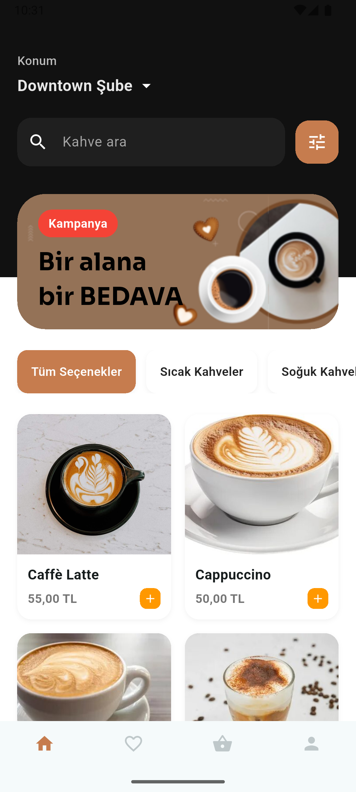
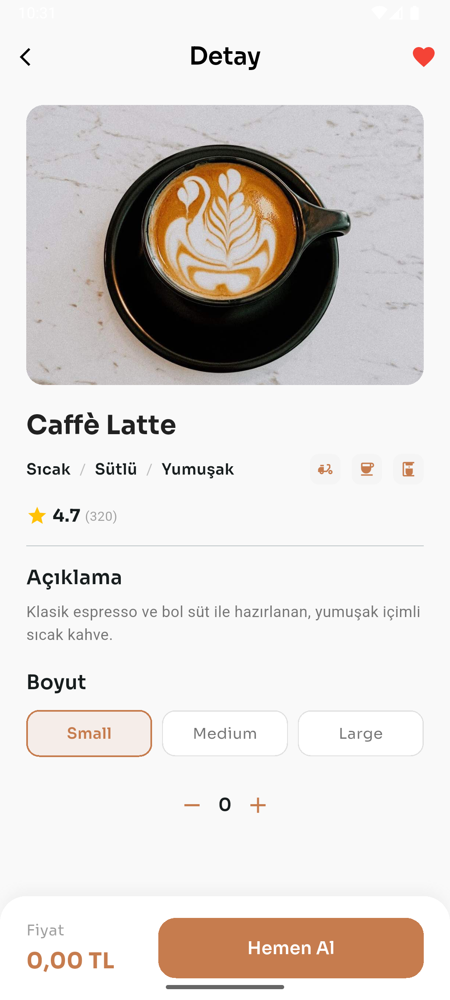
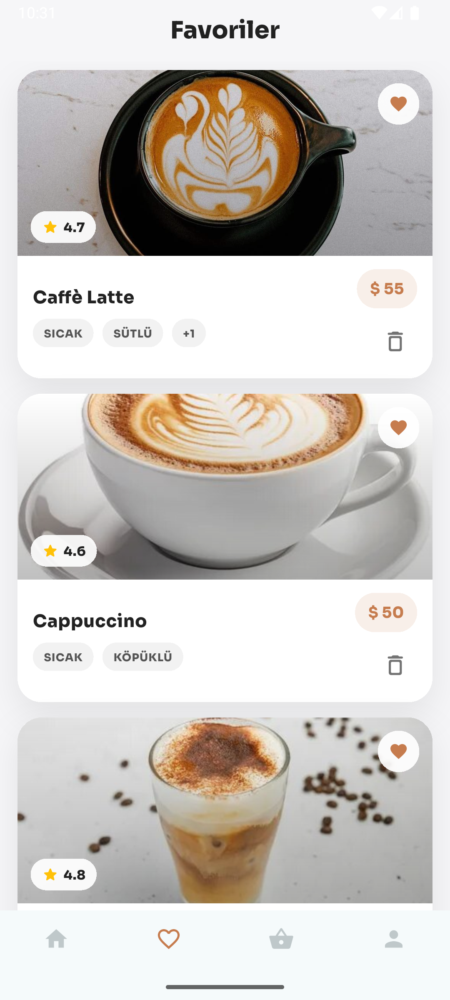
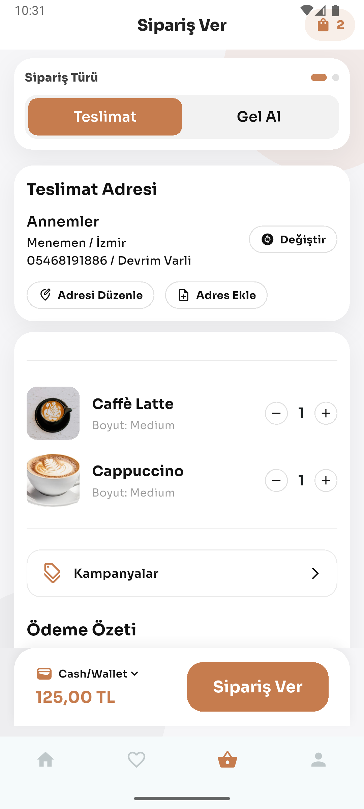
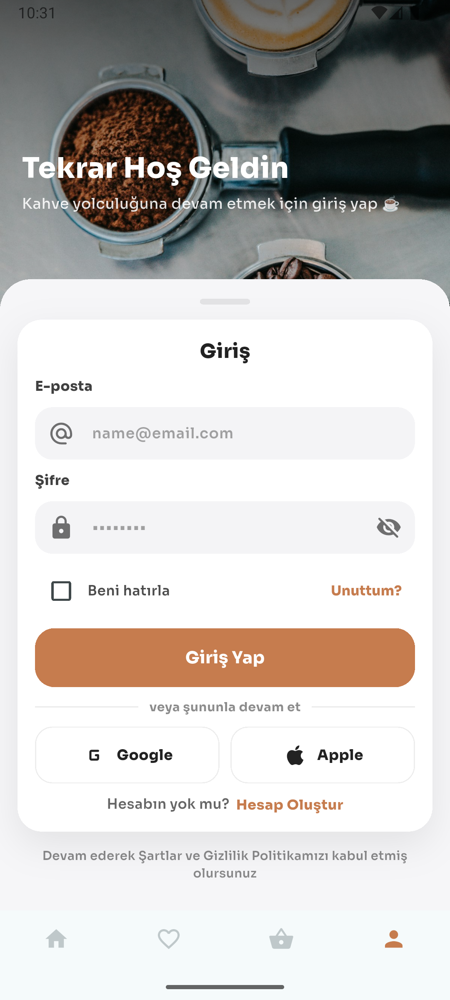
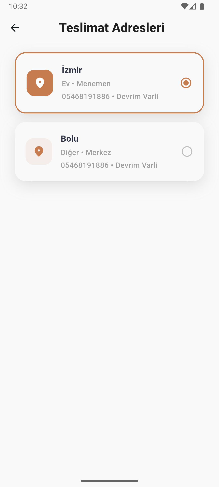
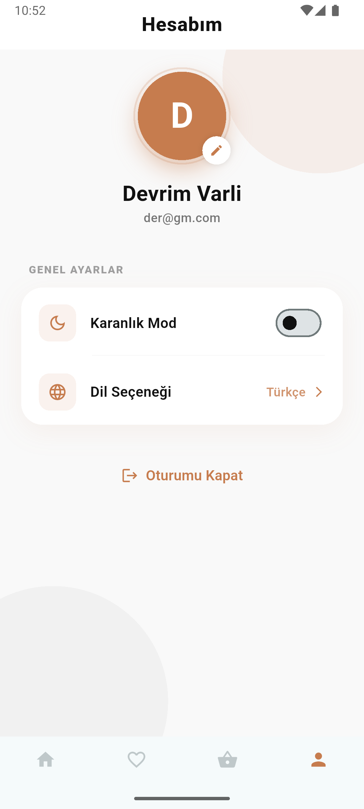
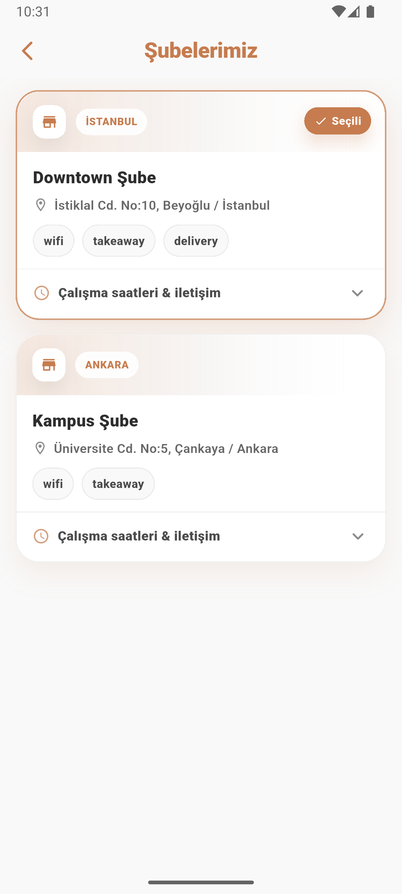
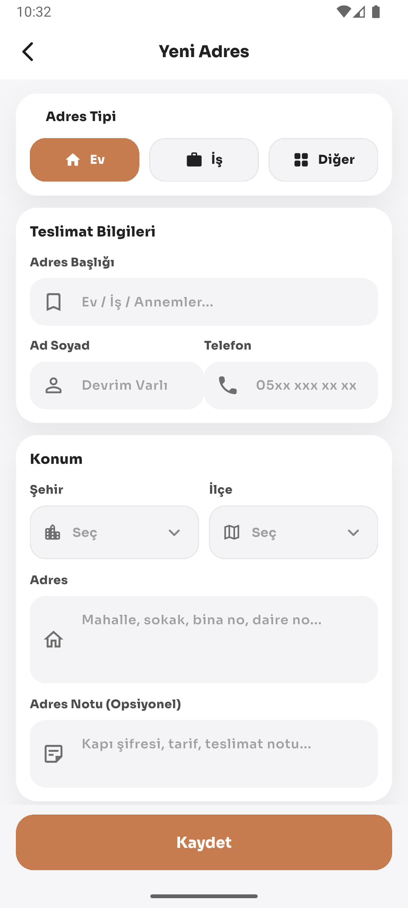
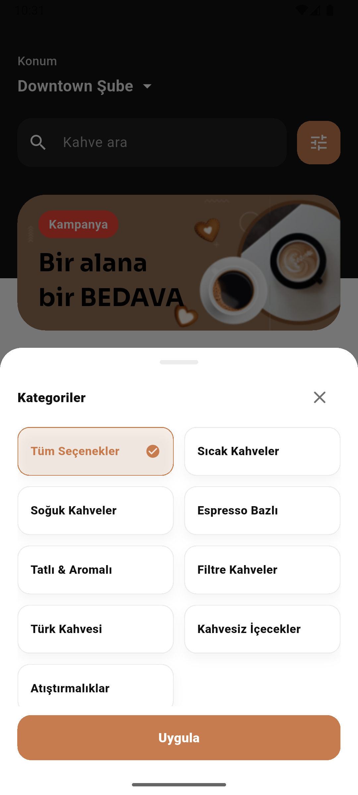

# ☕ Coffee App


Flutter ile geliştirilmiş **modern, ölçeklenebilir ve production-ready** bir kahve sipariş uygulaması.  
Uygulama; gerçek dünya senaryolarını baz alarak **temiz mimari**, **state yönetimi**, **Firebase entegrasyonu** ve **offline destek** prensipleriyle geliştirilmiştir.

> **Tech Stack:** Flutter · Riverpod · Firebase · Hive CE · GoRouter · Freezed

---

## 📸 Preview

| Home | Detail | Favorite | Basket | Login | Address | Profile | Branches | New Address | Filter |
|-------|------|--------|--------|-------|------|--------|--------|-------|------|
|  |  |  |  |  |  |  |  |  |  |

---

## 🎯 Proje Amacı

Coffee App, gerçek bir kahve sipariş uygulamasının **uçtan uca (end-to-end)** bir simülasyonunu sunmak amacıyla geliştirilmiştir.

Bu proje ile:
- modern Flutter mimarisi,
- Riverpod ile state yönetimi,
- Firebase Authentication & Firestore,
- offline-first yaklaşımı,
- feature-based ölçeklenebilir yapı

konularında **gerçek dünya pratiği** hedeflenmiştir.

---

## 🚀 Özellikler

### 🔐 Kimlik Doğrulama
- Firebase Authentication
- Email / Password Login & Register
- Google Sign-In
- Apple Sign-In (UI hazır)

### 🏠 Uygulama Akışı
- Ürün listeleme ve detay sayfası
- Kategori bazlı filtreleme (BottomSheet)
- Favori ürünler
- Sepet yönetimi & sipariş özeti
- Adres ekleme / düzenleme
- Şube listeleme
- Profil yönetimi

### ⚡ State Management
- Riverpod (Code Generation)
- Global state’ler: Auth, Locale
- Feature state’leri: Category, Basket
- Async state yönetimi (Firebase / API)

### 🌍 Localization
- easy_localization ile **TR / EN**
- Anlık dil değiştirme
- JSON tabanlı çeviri dosyaları

### 💾 Offline & Cache
- Hive CE ile local storage
- Favoriler & sepet verileri için cache

### 🎨 UI / UX
- Cafe temalı modern tasarım
- Shimmer loading efektleri
- Google Fonts
- Custom BottomSheet & Card bileşenleri

---

## 🧠 Mimari Yaklaşım

Uygulama **Feature-First Architecture** ile geliştirilmiştir.

Her feature kendi içinde şu katmanları barındırır:

- **data** → repository, datasource
- **domain** → model, business logic
- **presentation** → UI, controller

Bu yaklaşım sayesinde:
- Kod tekrarları azalır
- Test edilebilirlik artar
- Yeni feature eklemek kolaylaşır
- Büyük projelerde sürdürülebilirlik sağlanır

---

## 📂 Proje Yapısı

```text
lib/
├── common/              # Ortak widget ve bileşenler
├── constants/           # Renkler, sabitler
├── features/
│   ├── authentication/  # Login & Register
│   ├── home/            # Ana sayfa
│   ├── detail/          # Ürün detay
│   ├── basket/          # Sepet
│   ├── favorite/        # Favoriler
│   ├── profile/         # Profil
│   ├── address/         # Adres yönetimi
│   └── stores/          # Şubeler
├── hive/                # Local DB
├── router/              # GoRouter
├── utils/               # Validator, helper
└── main.dart
---

## 📦 Kurulum

```bash
git clone https://github.com/DevrimVarli/coffee-app.git
cd coffee-app
flutter pub get
flutter pub run build_runner build --delete-conflicting-outputs
flutter run
